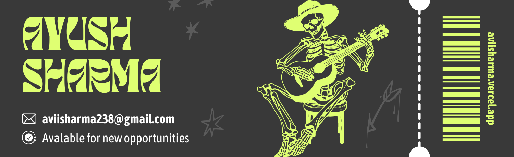

## Hi there 👋

<!--
**aviisharma238/aviisharma238** is a ✨ _special_ ✨ repository because its `README.md` (this file) appears on your GitHub profile.

Here are some ideas to get you started:

- 🔭 I’m currently working on ...
- 🌱 I’m currently learning ...
- 👯 I’m looking to collaborate on ...
- 🤔 I’m looking for help with ...
- 💬 Ask me about ...
- 📫 How to reach me: ...
- 😄 Pronouns: ...
- ⚡ Fun fact: ...
-->
 <!--  -->

<!-- <h1 align="center"></h1> -->

  
<!--
 

  
    Hi, I'm Aayush Bharti,
  
  
    
  
  
    a Full Stack Developer based in India.
  

 -->

 

<a href="https://x.com/ayusharm1a" target="_blank"></img></a>

<h3>A Full Stack Engineer</h3>

- 🌱 I'm currently learning **linux**

- 👨‍💻 All of my projects are available at [ayusharm1a.in/work](https://aviisharma.vercel.app/work)

- 📝 I regularly write articles on [ayusharm1a.in/blog](https://aviisharma.vercel.app/blog)

- 💬 Ask me about **next.js, typescript, framer motion, node.js**

- 📫 How to reach me **<ayusharm1a@gmail.com>**

 

 &ensp; <b> Things I code with</b>
 

<!--  -->

  <!-- jest -->

  

     &ensp;
    <b>Stats Overview</b>

  
  

   

  

    
      
    
    
      
    
    
      
    
    
      
    
  

<!-- 
Made with ❤️ in India
 -->

   

  
  

